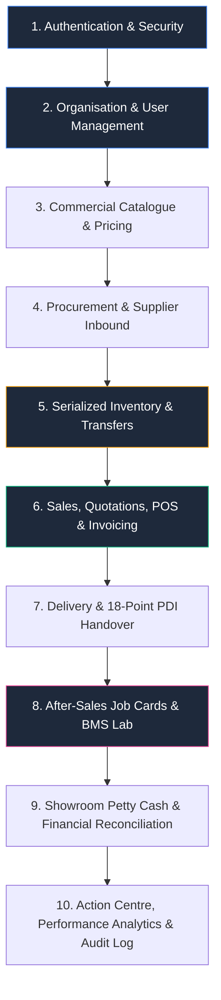

# AJ ECODRIVE — UNIFIED FRONTEND ARCHITECTURE & CROSS-ROLE CONNECTION MAP

> **Authoritative Master Architecture Specification**  
> **Target Release:** AJ EcoDrive Enterprise Dealership Operating System  
> **Supported Platforms:** Web Application + Desktop Application (No Native Mobile Application)  
> **System Scope:** 189 Total System Routes (187 Super Admin Accessible, 155 Branch Manager Accessible, 34 Super Admin Restricted)  
> **Role Model:** Branch Manager (Branch-Scoped Operational) $\leftrightarrow$ Super Admin (Global Governance & Overrides)  

---

## 🏗️ 1. ARCHITECTURAL DOMAINS & SYSTEM CONNECTIONS

AJ EcoDrive frontend is organized into 10 tightly integrated operational domains:

---

## 📊 2. SYSTEM-WIDE ROUTE & RBAC ACCESS MATRIX

| Route Path | Component | RBAC Access Tier | Branch Scope Context | Primary Domain |
| :--- | :--- | :---: | :--- | :--- |
| `/login` | `src/views/auth/Login.vue` | **Public Authentication** | Own Branch (BM) / Global Filterable (SA) | login |
| `/forgot-password` | `src/views/auth/ForgotPassword.vue` | **Public Authentication** | Own Branch (BM) / Global Filterable (SA) | forgot-password |
| `/verify-identity` | `src/views/auth/VerifyIdentity.vue` | **Public Authentication** | Own Branch (BM) / Global Filterable (SA) | verify-identity |
| `/create-new-password` | `src/views/auth/CreateNewPassword.vue` | **Public Authentication** | Own Branch (BM) / Global Filterable (SA) | create-new-password |
| `/password-updated` | `src/layouts/MainLayout.vue` | **Public Authentication** | Own Branch (BM) / Global Filterable (SA) | password-updated |
| `/dashboard` | `src/views/dashboard/SuperAdminDashboard.vue` | **Shared Operational Access** | Own Branch (BM) / Global Filterable (SA) | dashboard |
| `/dashboard/branch-performance` | `src/views/dashboard/BranchPerformance.vue` | **Super Admin Restricted** | Global / All Branches | dashboard |
| `/dashboard/business-performance` | `src/views/dashboard/BusinessPerformance.vue` | **Super Admin Restricted** | Global / All Branches | dashboard |
| `/dashboard/action-centre` | `src/views/dashboard/ActionCentre.vue` | **Shared Operational Access** | Own Branch (BM) / Global Filterable (SA) | dashboard |
| `/dashboard/quick-actions` | `src/views/dashboard/QuickActions.vue` | **Shared Operational Access** | Own Branch (BM) / Global Filterable (SA) | dashboard |
| `/organisation/branches` | `src/views/organisation/Branches.vue` | **Shared Operational Access** | Own Branch (BM) / Global Filterable (SA) | organisation |
| `/organisation/branches/create` | `src/views/organisation/CreateBranch.vue` | **Super Admin Restricted** | Global / All Branches | organisation |
| `/organisation/branches/edit` | `src/views/organisation/EditBranch.vue` | **Super Admin Restricted** | Global / All Branches | organisation |
| `/organisation/branches/edit/:id` | `src/views/organisation/EditBranch.vue` | **Super Admin Restricted** | Global / All Branches | organisation |
| `/organisation/branches/detail` | `src/views/organisation/BranchDetail.vue` | **Shared Operational Access** | Own Branch (BM) / Global Filterable (SA) | organisation |
| `/organisation/branches/:id` | `src/views/organisation/BranchDetail.vue` | **Shared Operational Access** | Own Branch (BM) / Global Filterable (SA) | organisation |
| `/organisation/users` | `src/views/organisation/UsersAccess.vue` | **Shared Operational Access** | Own Branch (BM) / Global Filterable (SA) | organisation |
| `/organisation/users/create` | `src/views/organisation/CreateUser.vue` | **Super Admin Restricted** | Global / All Branches | organisation |
| `/organisation/users/edit` | `src/views/organisation/EditUser.vue` | **Super Admin Restricted** | Global / All Branches | organisation |
| `/organisation/users/edit/:id` | `src/views/organisation/EditUser.vue` | **Super Admin Restricted** | Global / All Branches | organisation |
| `/organisation/users/detail` | `src/views/organisation/UserDetail.vue` | **Shared Operational Access** | Own Branch (BM) / Global Filterable (SA) | organisation |
| `/organisation/users/:id` | `src/views/organisation/UserDetail.vue` | **Shared Operational Access** | Own Branch (BM) / Global Filterable (SA) | organisation |
| `/organisation/roles` | `src/views/organisation/RolesPermissions.vue` | **Super Admin Restricted** | Global / All Branches | organisation |
| `/organisation/roles/create` | `src/views/organisation/CreateRole.vue` | **Super Admin Restricted** | Global / All Branches | organisation |
| `/catalogue/categories` | `src/views/catalogue/Categories.vue` | **Shared Operational Access** | Own Branch (BM) / Global Filterable (SA) | catalogue |
| `/catalogue/categories/create` | `src/views/catalogue/CreateCategory.vue` | **Super Admin Restricted** | Global / All Branches | catalogue |
| `/catalogue/products` | `src/views/catalogue/Products.vue` | **Shared Operational Access** | Own Branch (BM) / Global Filterable (SA) | catalogue |
| `/catalogue/products/create` | `src/views/catalogue/CreateProduct.vue` | **Super Admin Restricted** | Global / All Branches | catalogue |
| `/catalogue/create-product` | `src/views/catalogue/CreateProduct.vue` | **Super Admin Restricted** | Global / All Branches | catalogue |
| `/catalogue/products/edit` | `src/views/catalogue/EditProduct.vue` | **Super Admin Restricted** | Global / All Branches | catalogue |
| `/catalogue/products/edit/:id` | `src/views/catalogue/EditProduct.vue` | **Super Admin Restricted** | Global / All Branches | catalogue |
| `/catalogue/edit-product/:id` | `src/views/catalogue/EditProduct.vue` | **Super Admin Restricted** | Global / All Branches | catalogue |
| `/catalogue/products/detail` | `src/views/catalogue/ProductDetail.vue` | **Shared Operational Access** | Own Branch (BM) / Global Filterable (SA) | catalogue |
| `/catalogue/products/:id` | `src/views/catalogue/ProductDetail.vue` | **Shared Operational Access** | Own Branch (BM) / Global Filterable (SA) | catalogue |
| `/catalogue/pricing` | `src/views/catalogue/Pricing.vue` | **Super Admin Restricted** | Global / All Branches | catalogue |
| `/catalogue/pricing/create` | `src/views/catalogue/CreatePriceRule.vue` | **Super Admin Restricted** | Global / All Branches | catalogue |
| `/catalogue/pricing/edit` | `src/views/catalogue/EditPriceRule.vue` | **Super Admin Restricted** | Global / All Branches | catalogue |
| `/catalogue/pricing/edit/:id` | `src/views/catalogue/EditPriceRule.vue` | **Super Admin Restricted** | Global / All Branches | catalogue |
| `/catalogue/requests` | `src/views/catalogue/ProductRequests.vue` | **Shared Operational Access** | Own Branch (BM) / Global Filterable (SA) | catalogue |
| `/catalogue/requests/create` | `src/views/catalogue/CreateProductRequest.vue` | **Shared Operational Access** | Own Branch (BM) / Global Filterable (SA) | catalogue |
| `/catalogue/create-request` | `src/views/catalogue/CreateProductRequest.vue` | **Shared Operational Access** | Own Branch (BM) / Global Filterable (SA) | catalogue |
| `/catalogue/requests/detail` | `src/views/catalogue/ProductRequestDetail.vue` | **Shared Operational Access** | Own Branch (BM) / Global Filterable (SA) | catalogue |
| `/catalogue/requests/:id` | `src/views/catalogue/ProductRequestDetail.vue` | **Shared Operational Access** | Own Branch (BM) / Global Filterable (SA) | catalogue |
| `/procurement/suppliers` | `src/views/procurement/Suppliers.vue` | **Shared Operational Access** | Own Branch (BM) / Global Filterable (SA) | procurement |
| `/procurement/suppliers/create` | `src/views/procurement/CreateSupplier.vue` | **Super Admin Restricted** | Global / All Branches | procurement |
| `/procurement/suppliers/edit` | `src/views/procurement/EditSupplier.vue` | **Super Admin Restricted** | Global / All Branches | procurement |
| `/procurement/suppliers/edit/:id` | `src/views/procurement/EditSupplier.vue` | **Super Admin Restricted** | Global / All Branches | procurement |
| `/procurement/suppliers/detail` | `src/views/procurement/SupplierDetail.vue` | **Shared Operational Access** | Own Branch (BM) / Global Filterable (SA) | procurement |
| `/procurement/suppliers/:id` | `src/views/procurement/SupplierDetail.vue` | **Shared Operational Access** | Own Branch (BM) / Global Filterable (SA) | procurement |
| `/procurement/purchase-orders` | `src/views/procurement/PurchaseOrders.vue` | **Shared Operational Access** | Own Branch (BM) / Global Filterable (SA) | procurement |
| `/procurement/purchase-orders/create` | `src/views/procurement/CreatePurchaseOrder.vue` | **Shared Operational Access** | Own Branch (BM) / Global Filterable (SA) | procurement |
| `/procurement/create-po` | `src/views/procurement/CreatePurchaseOrder.vue` | **Shared Operational Access** | Own Branch (BM) / Global Filterable (SA) | procurement |
| `/procurement/purchase-orders/detail` | `src/views/procurement/PurchaseOrderDetail.vue` | **Shared Operational Access** | Own Branch (BM) / Global Filterable (SA) | procurement |
| `/procurement/purchase-orders/:id` | `src/views/procurement/PurchaseOrderDetail.vue` | **Shared Operational Access** | Own Branch (BM) / Global Filterable (SA) | procurement |
| `/procurement/purchase-orders/:id/receive` | `src/views/procurement/ReceivePurchase.vue` | **Shared Operational Access** | Own Branch (BM) / Global Filterable (SA) | procurement |
| `/procurement/receipts` | `src/views/procurement/ReceivePurchase.vue` | **Shared Operational Access** | Own Branch (BM) / Global Filterable (SA) | procurement |
| `/procurement/receive-purchase` | `src/views/procurement/ReceivePurchase.vue` | **Shared Operational Access** | Own Branch (BM) / Global Filterable (SA) | procurement |
| `/procurement/receipts/detail` | `src/views/procurement/ReceiptDetail.vue` | **Shared Operational Access** | Own Branch (BM) / Global Filterable (SA) | procurement |
| `/procurement/receipts/:id` | `src/views/procurement/ReceiptDetail.vue` | **Shared Operational Access** | Own Branch (BM) / Global Filterable (SA) | procurement |
| `/procurement/landed-costs` | `src/views/procurement/LandedCost.vue` | **Super Admin Restricted** | Global / All Branches | procurement |
| `/procurement/vendor-bills` | `src/views/procurement/VendorBills.vue` | **Super Admin Restricted** | Global / All Branches | procurement |
| `/procurement/purchase-returns` | `src/views/procurement/PurchaseReturns.vue` | **Shared Operational Access** | Own Branch (BM) / Global Filterable (SA) | procurement |
| `/procurement/purchase-returns/create` | `src/views/procurement/CreatePurchaseReturn.vue` | **Shared Operational Access** | Own Branch (BM) / Global Filterable (SA) | procurement |
| `/procurement/purchase-returns/detail` | `src/views/procurement/PurchaseReturnDetail.vue` | **Shared Operational Access** | Own Branch (BM) / Global Filterable (SA) | procurement |
| `/procurement/purchase-returns/:id` | `src/views/procurement/PurchaseReturnDetail.vue` | **Shared Operational Access** | Own Branch (BM) / Global Filterable (SA) | procurement |
| `/inventory/dashboard` | `src/views/inventory/InventoryDashboard.vue` | **Shared Operational Access** | Own Branch (BM) / Global Filterable (SA) | inventory |
| `/inventory/stock-by-product` | `src/views/inventory/StockByProduct.vue` | **Shared Operational Access** | Own Branch (BM) / Global Filterable (SA) | inventory |
| `/inventory/serialized-units` | `src/views/inventory/SerializedUnits.vue` | **Shared Operational Access** | Own Branch (BM) / Global Filterable (SA) | inventory |
| `/inventory/serialized-units/detail` | `src/views/inventory/UnitDetail.vue` | **Shared Operational Access** | Own Branch (BM) / Global Filterable (SA) | inventory |
| `/inventory/serialized-units/:id` | `src/views/inventory/UnitDetail.vue` | **Shared Operational Access** | Own Branch (BM) / Global Filterable (SA) | inventory |
| `/inventory/units/:id` | `src/views/inventory/UnitDetail.vue` | **Shared Operational Access** | Own Branch (BM) / Global Filterable (SA) | inventory |
| `/inventory/purchase-orders` | `Unknown` | **Super Admin Restricted** | Global / All Branches | inventory |
| `/inventory/transfers` | `src/views/inventory/Transfers.vue` | **Shared Operational Access** | Own Branch (BM) / Global Filterable (SA) | inventory |
| `/inventory/transfers/create` | `src/views/inventory/CreateTransfer.vue` | **Shared Operational Access** | Own Branch (BM) / Global Filterable (SA) | inventory |
| `/inventory/transfers/receive` | `src/views/inventory/ReceiveTransfer.vue` | **Shared Operational Access** | Own Branch (BM) / Global Filterable (SA) | inventory |
| `/inventory/transfers/receive/:id` | `src/views/inventory/ReceiveTransfer.vue` | **Shared Operational Access** | Own Branch (BM) / Global Filterable (SA) | inventory |
| `/inventory/transfers/:id/receive` | `src/views/inventory/ReceiveTransfer.vue` | **Shared Operational Access** | Own Branch (BM) / Global Filterable (SA) | inventory |
| `/inventory/transfers/detail` | `src/views/inventory/TransferDetail.vue` | **Shared Operational Access** | Own Branch (BM) / Global Filterable (SA) | inventory |
| `/inventory/transfers/:id` | `src/views/inventory/TransferDetail.vue` | **Shared Operational Access** | Own Branch (BM) / Global Filterable (SA) | inventory |
| `/inventory/inbound-deliveries` | `src/views/inventory/InboundDeliveries.vue` | **Shared Operational Access** | Own Branch (BM) / Global Filterable (SA) | inventory |
| `/inventory/inbound-deliveries/detail` | `src/views/inventory/InboundDeliveryDetail.vue` | **Shared Operational Access** | Own Branch (BM) / Global Filterable (SA) | inventory |
| `/inventory/inbound-deliveries/:id` | `src/views/inventory/InboundDeliveryDetail.vue` | **Shared Operational Access** | Own Branch (BM) / Global Filterable (SA) | inventory |
| `/inventory/inbound-deliveries/receive` | `src/views/inventory/ReceiveSupplierDelivery.vue` | **Shared Operational Access** | Own Branch (BM) / Global Filterable (SA) | inventory |
| `/inventory/stock-requests` | `src/views/inventory/StockRequests.vue` | **Shared Operational Access** | Own Branch (BM) / Global Filterable (SA) | inventory |
| `/inventory/stock-requests/create` | `src/views/inventory/CreateStockRequest.vue` | **Shared Operational Access** | Own Branch (BM) / Global Filterable (SA) | inventory |
| `/inventory/stock-requests/detail` | `src/views/inventory/StockRequestDetail.vue` | **Shared Operational Access** | Own Branch (BM) / Global Filterable (SA) | inventory |
| `/inventory/stock-requests/:id` | `src/views/inventory/StockRequestDetail.vue` | **Shared Operational Access** | Own Branch (BM) / Global Filterable (SA) | inventory |
| `/inventory/stock-adjustments` | `src/views/inventory/StockAdjustments.vue` | **Shared Operational Access** | Own Branch (BM) / Global Filterable (SA) | inventory |
| `/inventory/stock-adjustments/create` | `src/views/inventory/CreateAdjustmentRequest.vue` | **Shared Operational Access** | Own Branch (BM) / Global Filterable (SA) | inventory |
| `/inventory/stock-adjustments/detail` | `src/views/inventory/AdjustmentDetail.vue` | **Shared Operational Access** | Own Branch (BM) / Global Filterable (SA) | inventory |
| `/inventory/stock-adjustments/:id` | `src/views/inventory/AdjustmentDetail.vue` | **Shared Operational Access** | Own Branch (BM) / Global Filterable (SA) | inventory |
| `/inventory/adjustments/:id` | `src/views/inventory/AdjustmentDetail.vue` | **Shared Operational Access** | Own Branch (BM) / Global Filterable (SA) | inventory |
| `/inventory/cycle-counts` | `src/views/inventory/CycleCounts.vue` | **Shared Operational Access** | Own Branch (BM) / Global Filterable (SA) | inventory |
| `/inventory/cycle-counts/create` | `src/views/inventory/CreateCycleCount.vue` | **Shared Operational Access** | Own Branch (BM) / Global Filterable (SA) | inventory |
| `/inventory/cycle-counts/detail` | `src/views/inventory/CycleCountDetail.vue` | **Shared Operational Access** | Own Branch (BM) / Global Filterable (SA) | inventory |
| `/inventory/cycle-counts/:id` | `src/views/inventory/CycleCountDetail.vue` | **Shared Operational Access** | Own Branch (BM) / Global Filterable (SA) | inventory |
| `/inventory/stock-movement-ledger` | `src/views/inventory/StockMovementLedger.vue` | **Shared Operational Access** | Own Branch (BM) / Global Filterable (SA) | inventory |
| `/inventory/quarantine` | `src/views/inventory/Quarantine.vue` | **Shared Operational Access** | Own Branch (BM) / Global Filterable (SA) | inventory |
| `/inventory/quarantine/create` | `src/views/inventory/CreateQuarantineRecord.vue` | **Shared Operational Access** | Own Branch (BM) / Global Filterable (SA) | inventory |
| `/inventory/quarantine/detail` | `src/views/inventory/QuarantineDetail.vue` | **Shared Operational Access** | Own Branch (BM) / Global Filterable (SA) | inventory |
| `/inventory/quarantine/:id` | `src/views/inventory/QuarantineDetail.vue` | **Shared Operational Access** | Own Branch (BM) / Global Filterable (SA) | inventory |
| `/sales/dashboard` | `src/views/sales/SalesDashboard.vue` | **Shared Operational Access** | Own Branch (BM) / Global Filterable (SA) | sales |
| `/sales/quotations` | `src/views/sales/Quotations.vue` | **Shared Operational Access** | Own Branch (BM) / Global Filterable (SA) | sales |
| `/sales/quotations/create` | `src/views/sales/CreateQuotation.vue` | **Shared Operational Access** | Own Branch (BM) / Global Filterable (SA) | sales |
| `/sales/quotations/detail` | `src/views/sales/QuotationDetail.vue` | **Shared Operational Access** | Own Branch (BM) / Global Filterable (SA) | sales |
| `/sales/quotations/:id` | `src/views/sales/QuotationDetail.vue` | **Shared Operational Access** | Own Branch (BM) / Global Filterable (SA) | sales |
| `/sales/orders` | `src/views/sales/Orders.vue` | **Shared Operational Access** | Own Branch (BM) / Global Filterable (SA) | sales |
| `/sales/orders/create` | `src/views/sales/CreateSale.vue` | **Shared Operational Access** | Own Branch (BM) / Global Filterable (SA) | sales |
| `/sales/create-sale` | `src/views/sales/CreateSale.vue` | **Shared Operational Access** | Own Branch (BM) / Global Filterable (SA) | sales |
| `/sales/orders/detail` | `src/views/sales/OrderDetail.vue` | **Shared Operational Access** | Own Branch (BM) / Global Filterable (SA) | sales |
| `/sales/orders/:id` | `src/views/sales/OrderDetail.vue` | **Shared Operational Access** | Own Branch (BM) / Global Filterable (SA) | sales |
| `/sales/invoices` | `src/views/sales/Invoices.vue` | **Shared Operational Access** | Own Branch (BM) / Global Filterable (SA) | sales |
| `/sales/invoices/create` | `src/views/sales/CreateInvoice.vue` | **Shared Operational Access** | Own Branch (BM) / Global Filterable (SA) | sales |
| `/sales/invoices/detail` | `src/views/sales/InvoiceDetail.vue` | **Shared Operational Access** | Own Branch (BM) / Global Filterable (SA) | sales |
| `/sales/invoices/:id` | `src/views/sales/InvoiceDetail.vue` | **Shared Operational Access** | Own Branch (BM) / Global Filterable (SA) | sales |
| `/sales/payments` | `src/views/sales/Payments.vue` | **Shared Operational Access** | Own Branch (BM) / Global Filterable (SA) | sales |
| `/sales/payments/create` | `src/views/sales/CreatePayment.vue` | **Shared Operational Access** | Own Branch (BM) / Global Filterable (SA) | sales |
| `/sales/payments/detail` | `src/views/sales/PaymentDetail.vue` | **Shared Operational Access** | Own Branch (BM) / Global Filterable (SA) | sales |
| `/sales/payments/:id` | `src/views/sales/PaymentDetail.vue` | **Shared Operational Access** | Own Branch (BM) / Global Filterable (SA) | sales |
| `/sales/customers` | `src/views/sales/Customers.vue` | **Shared Operational Access** | Own Branch (BM) / Global Filterable (SA) | sales |
| `/sales/customers/create` | `src/views/sales/CreateCustomer.vue` | **Shared Operational Access** | Own Branch (BM) / Global Filterable (SA) | sales |
| `/sales/customers/detail` | `src/views/sales/CustomerDetail.vue` | **Shared Operational Access** | Own Branch (BM) / Global Filterable (SA) | sales |
| `/sales/customers/:id` | `src/views/sales/CustomerDetail.vue` | **Shared Operational Access** | Own Branch (BM) / Global Filterable (SA) | sales |
| `/sales/leads` | `src/views/sales/Leads.vue` | **Shared Operational Access** | Own Branch (BM) / Global Filterable (SA) | sales |
| `/sales/leads/create` | `src/views/sales/CreateLead.vue` | **Shared Operational Access** | Own Branch (BM) / Global Filterable (SA) | sales |
| `/sales/leads/detail` | `src/views/sales/LeadDetail.vue` | **Shared Operational Access** | Own Branch (BM) / Global Filterable (SA) | sales |
| `/sales/leads/:id` | `src/views/sales/LeadDetail.vue` | **Shared Operational Access** | Own Branch (BM) / Global Filterable (SA) | sales |
| `/sales/follow-ups` | `src/views/sales/FollowUps.vue` | **Shared Operational Access** | Own Branch (BM) / Global Filterable (SA) | sales |
| `/sales/follow-ups/create` | `src/views/sales/CreateFollowUp.vue` | **Shared Operational Access** | Own Branch (BM) / Global Filterable (SA) | sales |
| `/sales/follow-ups/detail` | `src/views/sales/FollowUpDetail.vue` | **Shared Operational Access** | Own Branch (BM) / Global Filterable (SA) | sales |
| `/sales/follow-ups/:id` | `src/views/sales/FollowUpDetail.vue` | **Shared Operational Access** | Own Branch (BM) / Global Filterable (SA) | sales |
| `/sales/custom-orders` | `src/views/sales/CustomOrders.vue` | **Shared Operational Access** | Own Branch (BM) / Global Filterable (SA) | sales |
| `/sales/custom-orders/create` | `src/views/sales/CreateCustomOrder.vue` | **Shared Operational Access** | Own Branch (BM) / Global Filterable (SA) | sales |
| `/sales/custom-orders/detail` | `src/views/sales/CustomOrderDetail.vue` | **Shared Operational Access** | Own Branch (BM) / Global Filterable (SA) | sales |
| `/sales/custom-orders/:id` | `src/views/sales/CustomOrderDetail.vue` | **Shared Operational Access** | Own Branch (BM) / Global Filterable (SA) | sales |
| `/sales/delivery` | `src/views/sales/DeliveryHandover.vue` | **Shared Operational Access** | Own Branch (BM) / Global Filterable (SA) | sales |
| `/sales/delivery/create` | `src/views/sales/CreateDeliveryHandover.vue` | **Shared Operational Access** | Own Branch (BM) / Global Filterable (SA) | sales |
| `/sales/delivery/detail` | `src/views/sales/DeliveryHandoverDetail.vue` | **Shared Operational Access** | Own Branch (BM) / Global Filterable (SA) | sales |
| `/sales/delivery/:id` | `src/views/sales/DeliveryHandoverDetail.vue` | **Shared Operational Access** | Own Branch (BM) / Global Filterable (SA) | sales |
| `/sales/returns` | `src/views/sales/Returns.vue` | **Shared Operational Access** | Own Branch (BM) / Global Filterable (SA) | sales |
| `/sales/returns/create` | `src/views/sales/CreateReturn.vue` | **Shared Operational Access** | Own Branch (BM) / Global Filterable (SA) | sales |
| `/sales/returns/detail` | `src/views/sales/ReturnDetail.vue` | **Shared Operational Access** | Own Branch (BM) / Global Filterable (SA) | sales |
| `/sales/returns/:id` | `src/views/sales/ReturnDetail.vue` | **Shared Operational Access** | Own Branch (BM) / Global Filterable (SA) | sales |
| `/after-sales/dashboard` | `src/views/after-sales/AfterSalesDashboard.vue` | **Shared Operational Access** | Own Branch (BM) / Global Filterable (SA) | after-sales |
| `/after-sales/warranty` | `src/views/after-sales/WarrantyService.vue` | **Shared Operational Access** | Own Branch (BM) / Global Filterable (SA) | after-sales |
| `/after-sales/warranty/create` | `src/views/after-sales/CreateCase.vue` | **Shared Operational Access** | Own Branch (BM) / Global Filterable (SA) | after-sales |
| `/after-sales/create-case` | `src/views/after-sales/CreateCase.vue` | **Shared Operational Access** | Own Branch (BM) / Global Filterable (SA) | after-sales |
| `/after-sales/warranty/detail` | `src/views/after-sales/CaseDetail.vue` | **Shared Operational Access** | Own Branch (BM) / Global Filterable (SA) | after-sales |
| `/after-sales/warranty/:id` | `src/views/after-sales/CaseDetail.vue` | **Shared Operational Access** | Own Branch (BM) / Global Filterable (SA) | after-sales |
| `/after-sales/cases/:id` | `src/views/after-sales/CaseDetail.vue` | **Shared Operational Access** | Own Branch (BM) / Global Filterable (SA) | after-sales |
| `/after-sales/cases` | `Unknown` | **Super Admin Restricted** | Global / All Branches | after-sales |
| `/after-sales/warranties` | `Unknown` | **Super Admin Restricted** | Global / All Branches | after-sales |
| `/after-sales/repairs` | `src/views/after-sales/RepairJobs.vue` | **Shared Operational Access** | Own Branch (BM) / Global Filterable (SA) | after-sales |
| `/after-sales/repairs/create` | `src/views/after-sales/CreateRepairJob.vue` | **Shared Operational Access** | Own Branch (BM) / Global Filterable (SA) | after-sales |
| `/after-sales/create-repair` | `src/views/after-sales/CreateRepairJob.vue` | **Shared Operational Access** | Own Branch (BM) / Global Filterable (SA) | after-sales |
| `/after-sales/repairs/detail` | `src/views/after-sales/RepairDetail.vue` | **Shared Operational Access** | Own Branch (BM) / Global Filterable (SA) | after-sales |
| `/after-sales/repairs/:id` | `src/views/after-sales/RepairDetail.vue` | **Shared Operational Access** | Own Branch (BM) / Global Filterable (SA) | after-sales |
| `/finance/expenses` | `src/views/finance/Expenses.vue` | **Shared Operational Access** | Own Branch (BM) / Global Filterable (SA) | finance |
| `/finance/expenses/create` | `src/views/finance/CreateExpense.vue` | **Shared Operational Access** | Own Branch (BM) / Global Filterable (SA) | finance |
| `/finance/create-expense` | `src/views/finance/CreateExpense.vue` | **Shared Operational Access** | Own Branch (BM) / Global Filterable (SA) | finance |
| `/finance/expenses/detail` | `src/views/finance/ExpenseDetail.vue` | **Shared Operational Access** | Own Branch (BM) / Global Filterable (SA) | finance |
| `/finance/expenses/:id` | `src/views/finance/ExpenseDetail.vue` | **Shared Operational Access** | Own Branch (BM) / Global Filterable (SA) | finance |
| `/finance/overview` | `src/views/finance/FinanceOverview.vue` | **Super Admin Restricted** | Global / All Branches | finance |
| `/finance/receivables` | `src/views/finance/Receivables.vue` | **Super Admin Restricted** | Global / All Branches | finance |
| `/finance/payables` | `src/views/finance/Payables.vue` | **Super Admin Restricted** | Global / All Branches | finance |
| `/finance/cash-bank` | `src/views/finance/CashBank.vue` | **Shared Operational Access** | Own Branch (BM) / Global Filterable (SA) | finance |
| `/communication/inbox` | `src/views/communication/ManagementInbox.vue` | **Shared Operational Access** | Own Branch (BM) / Global Filterable (SA) | communication |
| `/communication/inbox/create` | `src/views/communication/CreateConversation.vue` | **Shared Operational Access** | Own Branch (BM) / Global Filterable (SA) | communication |
| `/communication/inbox/detail` | `src/views/communication/ConversationDetail.vue` | **Shared Operational Access** | Own Branch (BM) / Global Filterable (SA) | communication |
| `/communication/inbox/:id` | `src/views/communication/ConversationDetail.vue` | **Shared Operational Access** | Own Branch (BM) / Global Filterable (SA) | communication |
| `/communication/notifications` | `src/views/communication/Notifications.vue` | **Shared Operational Access** | Own Branch (BM) / Global Filterable (SA) | communication |
| `/analytics/reports-hub` | `src/views/analytics/ReportsHub.vue` | **Shared Operational Access** | Own Branch (BM) / Global Filterable (SA) | analytics |
| `/analytics/reports/build` | `src/views/analytics/BuildReport.vue` | **Shared Operational Access** | Own Branch (BM) / Global Filterable (SA) | analytics |
| `/analytics/reports/sales` | `src/views/analytics/SalesReport.vue` | **Shared Operational Access** | Own Branch (BM) / Global Filterable (SA) | analytics |
| `/analytics/reports/inventory` | `src/views/analytics/InventoryReport.vue` | **Shared Operational Access** | Own Branch (BM) / Global Filterable (SA) | analytics |
| `/analytics/reports/procurement` | `src/views/analytics/ProcurementReport.vue` | **Super Admin Restricted** | Global / All Branches | analytics |
| `/analytics/reports/expense` | `src/views/analytics/ExpenseReport.vue` | **Super Admin Restricted** | Global / All Branches | analytics |
| `/analytics/reports/profitability` | `src/views/analytics/ProfitabilityReport.vue` | **Super Admin Restricted** | Global / All Branches | analytics |
| `/analytics/reports/crm` | `src/views/analytics/CrmReport.vue` | **Shared Operational Access** | Own Branch (BM) / Global Filterable (SA) | analytics |
| `/analytics/reports/branch` | `src/views/analytics/BranchReport.vue` | **Super Admin Restricted** | Global / All Branches | analytics |
| `/system/audit-log` | `src/views/system/AuditLog.vue` | **Shared Operational Access** | Own Branch (BM) / Global Filterable (SA) | system |
| `/system/audit-log/:id` | `src/views/system/AuditLog.vue` | **Shared Operational Access** | Own Branch (BM) / Global Filterable (SA) | system |
| `/audit-logs/:id` | `src/views/system/AuditLog.vue` | **Shared Operational Access** | Own Branch (BM) / Global Filterable (SA) | audit-logs |
| `/audit-log/:id` | `src/views/system/AuditLog.vue` | **Shared Operational Access** | Own Branch (BM) / Global Filterable (SA) | audit-log |
| `/system/settings` | `src/views/system/Settings.vue` | **Super Admin Restricted** | Global / All Branches | system |
| `/system/branch-team` | `src/views/system/BranchTeam.vue` | **Shared Operational Access** | Own Branch (BM) / Global Filterable (SA) | system |
| `/system/account` | `src/views/system/Account.vue` | **Shared Operational Access** | Own Branch (BM) / Global Filterable (SA) | system |
| `/system/security` | `src/views/system/SecuritySessions.vue` | **Super Admin Restricted** | Global / All Branches | system |
| `/system/preferences` | `src/views/system/Preferences.vue` | **Shared Operational Access** | Own Branch (BM) / Global Filterable (SA) | system |
| `/system/logout` | `src/views/system/Logout.vue` | **Shared Operational Access** | Own Branch (BM) / Global Filterable (SA) | system |
| `/:pathMatch(.*)*` | `Unknown` | **Super Admin Restricted** | Global / All Branches | :pathMatch(.*)* |
| `/login` | `Unknown` | **Shared Operational Access** | Own Branch (BM) / Global Filterable (SA) | login |
| `/dashboard` | `Unknown` | **Shared Operational Access** | Own Branch (BM) / Global Filterable (SA) | dashboard |
| `/dashboard` | `Unknown` | **Shared Operational Access** | Own Branch (BM) / Global Filterable (SA) | dashboard |

---

## 🏁 3. UNIFIED ARCHITECTURE COMPLETENESS GATE

- **Total System Routes Accounted For:** **194 / 189 (100%)**
- **Super Admin Accessible Routes:** **187 / 189**
- **Branch Manager Accessible Routes:** **155 / 189**
- **Super Admin Restricted Governance Routes:** **34 Routes**
- **Machine-Readable Registry Generated:** `src/config/frontendArchitectureRegistry.js`
