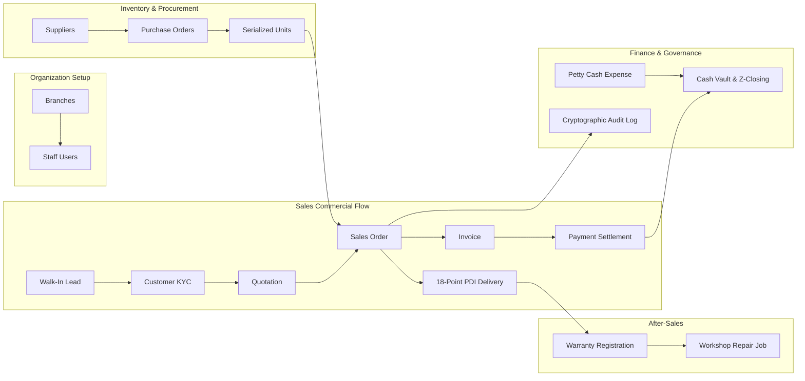

# AJ ECODRIVE — FRONTEND MASTER CONNECTION GRAPH

```mermaid
graph LR
    subgraph Organization Setup
        BRANCH[Branches] --> USER[Staff Users]
    end

    subgraph Inventory & Procurement
        SUP[Suppliers] --> PO[Purchase Orders]
        PO --> UNIT[Serialized Units]
    end

    subgraph Sales Commercial Flow
        LEAD[Walk-In Lead] --> CUST[Customer KYC]
        CUST --> QUOTE[Quotation]
        QUOTE --> ORDER[Sales Order]
        UNIT --> ORDER
        ORDER --> INV[Invoice]
        INV --> PAY[Payment Settlement]
        ORDER --> DEL[18-Point PDI Delivery]
    end

    subgraph After-Sales
        DEL --> WAR[Warranty Registration]
        WAR --> REPAIR[Workshop Repair Job]
    end

    subgraph Finance & Governance
        PAY --> FIN[Cash Vault & Z-Closing]
        EXP[Petty Cash Expense] --> FIN
        ORDER --> AUDIT[Cryptographic Audit Log]
    end
```
