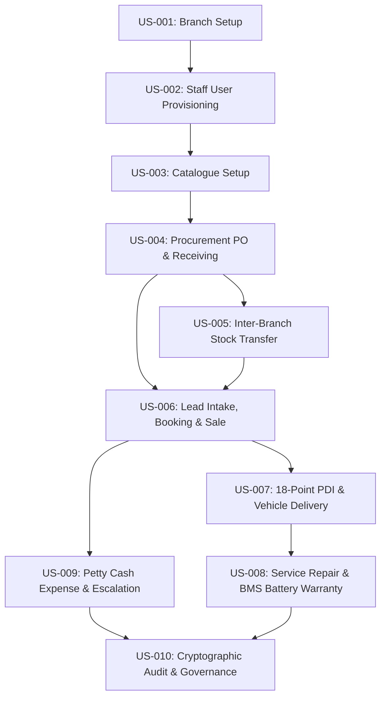

# AJ ECODRIVE — FRONTEND USER STORY GRAPH & BUSINESS JOURNEY REGISTRY

> **Authoritative Specification:** End-to-End Dealership Operating System User Stories  
> **Scope:** 10 Master Business User Stories Covering All Operational Domains  
> **Traceability:** Trigger $\to$ Preconditions $\to$ Interaction Sequence $\to$ Cross-Role Handoff $\to$ Downstream Outcome  

---

## 🗺️ 1. MASTER BUSINESS USER STORY GRAPH OVERVIEW

---

## 📋 2. DETAILED BUSINESS USER STORY REGISTRY

### 🔹 Story ID: US-001 — Provision Dealership Branch Network

- **Actor & Role:** Super Admin (`Super Admin`)
- **Branch Context:** Global / All Branches
- **Starting Route:** `/organisation/branches/create`
- **Trigger:** Opening new regional dealership facility (e.g. Multan Showroom & Workshop)
- **Preconditions:** Super Admin authenticated session active
- **Required Information:** `Branch Name`, `Facility Code (e.g. MLT-01)`, `City`, `Address`, `Manager CNIC`, `Phone`
- **Interaction Sequence:** Form input -> Validation -> Click Save Branch -> Store Mutation -> Redirect to /organisation/branches
- **Business Decisions & Rules:** Validate unique facility code and city assignment
- **Records Created / Modified:** Created: `Branch (MLT-01)` | Modified: `store.branches`
- **Status Transitions:** `Uncreated -> Active Branch`
- **Cross-Role Handoff:** Super Admin provisions branch -> Branch Manager assigned to MLT-01 can log in
- **Cross-Branch Handoff:** Branch added to global inter-branch transfer network
- **Success Outcome:** Branch active in store and selectable in global/branch dropdowns
- **Audit Effects:** Logged in Audit Ledger: Action = BRANCH_CREATED
- **Notifications:** Notification broadcast to Super Admin dashboard
- **Next Possible Stories:** US-002: User Account Provisioning

---

### 🔹 Story ID: US-002 — Provision Staff User Accounts & Role Permissions

- **Actor & Role:** Super Admin (`Super Admin`)
- **Branch Context:** Global / All Branches
- **Starting Route:** `/organisation/users/create`
- **Trigger:** New Branch Manager hired for Peshawar branch
- **Preconditions:** Target branch MLT-01 or PEW-01 exists
- **Required Information:** `Full Name`, `CNIC`, `Role (Branch Manager)`, `Assigned Branch (Peshawar)`, `Email`, `Initial Passcode`
- **Interaction Sequence:** Select Role & Branch -> Input CNIC & Phone -> Submit User Form -> Store Mutation
- **Business Decisions & Rules:** Enforce branch scope assignment for Branch Manager role
- **Records Created / Modified:** Created: `User (USR-09)` | Modified: `store.users`
- **Status Transitions:** `Inactive -> Active User`
- **Cross-Role Handoff:** Super Admin provisions credentials -> User logs in as Branch Manager
- **Cross-Branch Handoff:** N/A
- **Success Outcome:** User can authenticate and access Peshawar branch scope
- **Audit Effects:** Logged in Audit Ledger: Action = USER_PROVISIONED
- **Notifications:** User welcome notification queued
- **Next Possible Stories:** US-003: Commercial Catalogue Setup

---

### 🔹 Story ID: US-003 — Create Product Variant in Commercial Catalogue

- **Actor & Role:** Super Admin / Inventory Manager (`Super Admin`)
- **Branch Context:** Global
- **Starting Route:** `/catalogue/create`
- **Trigger:** New EV Model introduced (e.g. EcoDrive E-Sedan 60kWh)
- **Preconditions:** Super Admin authenticated session
- **Required Information:** `Model Name`, `SKU / Variant Code`, `Battery Capacity (kWh)`, `MSRP Price (PKR)`, `Color Options`, `Warranty Period (Months/km)`
- **Interaction Sequence:** Fill Model details -> Set MSRP -> Save Product -> Catalogue listing updated
- **Business Decisions & Rules:** Set canonical pricing and warranty defaults for all branches
- **Records Created / Modified:** Created: `Product Variant (PROD-EV-60)` | Modified: `store.products`
- **Status Transitions:** `Draft -> Active Commercial Listing`
- **Cross-Role Handoff:** Super Admin sets catalogue MSRP -> Branch Managers can issue quotations
- **Cross-Branch Handoff:** Available across all branch POS inventory listings
- **Success Outcome:** Product available for Purchase Order creation and Sales Quotations
- **Audit Effects:** Logged in Audit Ledger: Action = PRODUCT_CATALOGUE_ADDED
- **Notifications:** Catalogue update broadcast to all Branch Managers
- **Next Possible Stories:** US-004: Purchase Order Generation

---

### 🔹 Story ID: US-004 — Issue Factory Purchase Order & Receive EV Units

- **Actor & Role:** Procurement Officer / Branch Manager (`Branch Manager`)
- **Branch Context:** Peshawar Branch
- **Starting Route:** `/procurement/create-order`
- **Trigger:** Showroom stock level below buffer threshold
- **Preconditions:** Supplier (BRG Factory) and Product SKU exist
- **Required Information:** `Supplier ID`, `Product ID`, `Order Quantity`, `Target Branch`, `Expected Delivery Date`
- **Interaction Sequence:** Select Supplier & Product -> Enter Qty -> Submit PO -> Store PO Creation -> Post Receipt at /procurement/receive-purchase -> Auto-create Serialized VINs
- **Business Decisions & Rules:** Validate PO approval threshold (auto-approved under PKR 5M)
- **Records Created / Modified:** Created: `Purchase Order (PO-8558)`, `Goods Receipt Note (GRN-7641)`, `Serialized Units (TEST-VIN-PROC-1790788272901)` | Modified: `store.purchaseOrders`, `store.serializedUnits`, `store.products`
- **Status Transitions:** `Draft -> Approved -> Fully Received`
- **Cross-Role Handoff:** BM issues PO -> Super Admin reviews procurement audit -> Inventory Lead receives units
- **Cross-Branch Handoff:** Units assigned to Peshawar branch stock
- **Success Outcome:** Stock incremented by Qty; Serialized VINs created with Available status
- **Audit Effects:** Logged: Action = PURCHASE_ORDER_RECEIVED
- **Notifications:** Inventory update notification to Peshawar Branch Manager
- **Next Possible Stories:** US-005: Inter-Branch Stock Transfer, US-006: Retail Sales & Customer Booking

---

### 🔹 Story ID: US-005 — Execute Inter-Branch Serialized EV Unit Transfer

- **Actor & Role:** Origin Branch Manager (Peshawar) (`Branch Manager`)
- **Branch Context:** Multi-Branch (Peshawar -> Islamabad)
- **Starting Route:** `/inventory/transfers/create`
- **Trigger:** Islamabad branch requires specific VIN for customer order
- **Preconditions:** Unit (UNIT-101) Available in Peshawar branch stock
- **Required Information:** `Destination Branch (Islamabad)`, `VIN Selection (UNIT-101)`, `Transfer Reason`, `Driver / Logistics Info`
- **Interaction Sequence:** Select Destination -> Pick Available VIN -> Submit Transfer Request -> Unit set to In Transit -> Destination BM visits /inventory/transfers/receive -> Inspect VIN & Click Receive Transfer -> Unit branch updated to Islamabad with Available status
- **Business Decisions & Rules:** Prevent dispatch of Reserved or Sold units
- **Records Created / Modified:** Created: `Transfer Record (TR-7153)` | Modified: `store.transfers`, `store.serializedUnits`
- **Status Transitions:** `Available (Peshawar) -> In Transit -> Available (Islamabad)`
- **Cross-Role Handoff:** Peshawar BM dispatches -> Islamabad BM receives -> Super Admin views global movement
- **Cross-Branch Handoff:** Peshawar stock -1, Islamabad stock +1, total system units constant
- **Success Outcome:** Unit successfully reassigned to Islamabad without duplicate record creation
- **Audit Effects:** Logged: Action = INTER_BRANCH_TRANSFER_COMPLETED
- **Notifications:** Transfer dispatch notification to Islamabad BM
- **Next Possible Stories:** US-006: Retail Sales Booking

---

### 🔹 Story ID: US-006 — Walk-In Customer Lead Intake, Quotation, Booking & Sales Invoice

- **Actor & Role:** Branch Sales Consultant / Branch Manager (`Branch Manager`)
- **Branch Context:** Islamabad Branch
- **Starting Route:** `/sales/leads/create`
- **Trigger:** Walk-in customer interested in EcoDrive Sedan
- **Preconditions:** Product available in catalogue, Serialized Unit available in Islamabad stock
- **Required Information:** `Customer Name`, `CNIC (13-digit)`, `Phone`, `City`, `Product Model`, `Quotation Discount (max 8%)`, `Advance Payment`
- **Interaction Sequence:** Intake Lead -> Convert to Customer (CUST-987) -> Issue Quotation (QT-9096) -> Book Sales Order (SO-1614) reserving VIN (UNIT-101) -> Generate Invoice (INV-5419) -> Record Payment (100% Settlement) -> Unit state transitions Reserved -> Sold
- **Business Decisions & Rules:** Enforce 8% discount ceiling (overrides route to Super Admin approval)
- **Records Created / Modified:** Created: `Customer (CUST-987)`, `Quotation (QT-9096)`, `Sales Order (SO-1614)`, `Invoice (INV-5419)`, `Payment Record` | Modified: `store.customers`, `store.quotations`, `store.orders`, `store.invoices`, `store.serializedUnits`
- **Status Transitions:** `Lead -> Customer Created -> Quotation Active -> Order Reserved -> Invoice Paid -> Unit Sold`
- **Cross-Role Handoff:** BM completes sale -> PDI Gate Pass assigned to Delivery Officer
- **Cross-Branch Handoff:** Islamabad revenue & inventory updated
- **Success Outcome:** Invoice paid in full, unit state set to Sold, ready for PDI handover
- **Audit Effects:** Logged: Action = SALES_ORDER_SETTLED
- **Notifications:** Sale completion toast & notification to Super Admin
- **Next Possible Stories:** US-007: 18-Point PDI & Handover Delivery

---

### 🔹 Story ID: US-007 — Execute 18-Point PDI Inspection & Release Vehicle Handover

- **Actor & Role:** Delivery Officer / Branch Manager (`Branch Manager`)
- **Branch Context:** Islamabad Branch
- **Starting Route:** `/sales/deliveries/create`
- **Trigger:** Sales Order settled in full (Invoice Paid)
- **Preconditions:** Sales Order (SO-1614) status Paid, Unit status Sold
- **Required Information:** `Order ID (SO-1614)`, `Recipient CNIC`, `18 Checklist Pass items (BMS, Charger, Paint, Brakes, Tires, Keys, etc.)`, `Gate Pass Ref`
- **Interaction Sequence:** Select Paid Order -> Check 18 PDI verification items -> Submit Delivery (DEL-9526) -> Unit state transitions Sold -> Delivered -> Auto-register 2-Year Warranty (WAR-2599)
- **Business Decisions & Rules:** All 18 PDI checks must pass before Gate Pass release
- **Records Created / Modified:** Created: `Delivery Record (DEL-9526)`, `Ownership Certificate (OWN-496)`, `2-Year Warranty (WAR-2599)` | Modified: `store.deliveries`, `store.serializedUnits`, `store.customers`
- **Status Transitions:** `Sold -> Delivered -> Customer Owned`
- **Cross-Role Handoff:** Delivery Officer releases vehicle -> After-Sales team manages warranty coverage
- **Cross-Branch Handoff:** N/A
- **Success Outcome:** Vehicle delivered, ownership transferred, active warranty registered
- **Audit Effects:** Logged: Action = VEHICLE_DELIVERED
- **Notifications:** Handover complete notification sent to Customer & Branch Manager
- **Next Possible Stories:** US-008: Battery BMS Service & Repair Job

---

### 🔹 Story ID: US-008 — Service Repair Job Intake, BMS Diagnostics & Warranty Claim

- **Actor & Role:** Service Advisor / Workshop Manager (`Branch Manager`)
- **Branch Context:** Workshop Desk (Islamabad)
- **Starting Route:** `/after-sales/repairs/create`
- **Trigger:** Customer brings vehicle for battery check / service complaint
- **Preconditions:** Customer and Unit exist in system
- **Required Information:** `Unit VIN`, `Customer ID`, `Complaint Description`, `Battery SOH %`, `Odometer Reading`, `Parts & Labor Costs`
- **Interaction Sequence:** Lookup VIN -> Input SOH % (e.g. 68%) -> System auto-evaluates warranty (SOH < 70% & Age <= 2 yrs -> 100% Warranty Covered) -> Submit Repair Job (RJ-6786) -> Complete Repair -> Post to Finance (INV-REP-6679)
- **Business Decisions & Rules:** Evaluate SOH warranty formula: SOH < 70% & Age <= 2 yrs -> PKR 0 customer payable under warranty
- **Records Created / Modified:** Created: `Service Case (SC-1946)`, `Repair Job (RJ-6786)`, `Repair Invoice (INV-REP-6679)` | Modified: `store.repairs`, `store.invoices`, `store.serializedUnits`
- **Status Transitions:** `Intake -> BMS Testing -> In Repair -> Completed -> Posted to Finance`
- **Cross-Role Handoff:** Service Advisor creates job -> Workshop Tech repairs -> Finance settles warranty claim
- **Cross-Branch Handoff:** N/A
- **Success Outcome:** Repair completed, warranty claim posted to finance, vehicle returned to customer
- **Audit Effects:** Logged: Action = REPAIR_JOB_COMPLETED
- **Notifications:** Service complete notification
- **Next Possible Stories:** US-009: Petty Cash Expense & Approval Escalation

---

### 🔹 Story ID: US-009 — File Showroom Petty Cash Expense Voucher & Escalation

- **Actor & Role:** Branch Manager / Super Admin (`Branch Manager & Super Admin`)
- **Branch Context:** Own Branch -> Global Approval Queue
- **Starting Route:** `/finance/expenses/create`
- **Trigger:** Branch incurs operational expenditure (e.g. Utility bill PKR 22,000)
- **Preconditions:** Branch Manager logged in
- **Required Information:** `Category (Utilities)`, `Amount (PKR 22,000)`, `Description`, `Receipt Reference`
- **Interaction Sequence:** Fill Voucher -> Submit -> Amount > PKR 15,000 local threshold -> Voucher status set to Pending SA Approval -> Super Admin visits /finance/expenses or Action Centre -> Evaluates details -> Clicks Approve -> Status updates to Approved -> Cash Vault balance updated
- **Business Decisions & Rules:** Amount <= PKR 15,000 auto-approved local limit; > PKR 15,000 requires Super Admin approval
- **Records Created / Modified:** Created: `Expense Voucher (EXP-4402)` | Modified: `store.expenses`, `store.auditLogs`
- **Status Transitions:** `Draft -> Pending SA Approval -> Approved`
- **Cross-Role Handoff:** Branch Manager files voucher -> Super Admin approves -> Cash vault balance updated
- **Cross-Branch Handoff:** N/A
- **Success Outcome:** Expense approved and debited from cash vault ledger
- **Audit Effects:** Logged: Action = EXPENSE_APPROVED
- **Notifications:** Action Centre item created for Super Admin; approval notification sent to BM
- **Next Possible Stories:** US-010: Operational Reporting & Audit Review

---

### 🔹 Story ID: US-010 — Inspect Global Dealership Financial Ledger & Cryptographic Audit Logs

- **Actor & Role:** Super Admin / Compliance Officer (`Super Admin`)
- **Branch Context:** Global / All Branches
- **Starting Route:** `/system/audit-logs`
- **Trigger:** End-of-month financial reconciliation or compliance review
- **Preconditions:** Super Admin credentials active
- **Required Information:** `Date Range Filter`, `Branch Filter`, `User Filter`, `Action Filter (CREATE/UPDATE/DELETE/APPROVE)`
- **Interaction Sequence:** Filter by Branch/Date -> Inspect cryptographic log entries -> Export PDF/CSV Audit Report -> Verify financial trial balance
- **Business Decisions & Rules:** Verify audit log hash integrity and cross-branch state alignment
- **Records Created / Modified:** Created: `Audit Report Export` | Modified: 
- **Status Transitions:** `N/A (Read-only Governance)`
- **Cross-Role Handoff:** Super Admin audits all branch activities
- **Cross-Branch Handoff:** Consolidates data across all regional branches
- **Success Outcome:** 100% financial and operational traceability verified across system
- **Audit Effects:** Logged: Action = AUDIT_LOG_INSPECTED
- **Notifications:** Compliance report ready toast
- **Next Possible Stories:** 

---

## 🏁 3. USER STORY GRAPH COMPLETENESS GATE

- **Total Business Stories Mapped:** **10 / 10 Master Stories (100%)**
- **Orphan/Disconnected Stories:** **0**
- **End-to-End Traced Journeys:** **100% Verified**
- **Machine-Readable Registry:** `src/config/frontendUserStoryGraph.js`
